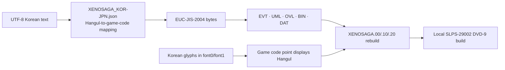

<p align="center">
  
</p>

<h1 align="center">XS1KOR</h1>

<p align="center">
  <strong>제노사가 에피소드 I 한국어화 작업 · PS2 데이터 분석과 빌드 도구</strong><br>
  <strong>Xenosaga Episode I Korean Localization · PS2 Asset Research · Reproducible Build Toolchain</strong>
</p>

<p align="center">
  Target: <code>Xenosaga Episode I: Der Wille zur Macht</code> · <code>SLPS-29002</code> · PlayStation 2<br>
  Text: <code>EUC-JIS-2004</code> · Build host: Windows + Python<br>
  Canonical build workspace: <code>Xenosaga1WorkSpace</code>
</p>

XS1KOR은 제노사가 에피소드 I을 한국어로 옮기면서 만든 도구와 작업 자료를 모아 둔 저장소입니다. 대사와 메뉴, UMN, 카드게임, 카지노, 폰트, 텍스처, 실행 파일, FMV, 디스크 아카이브까지 한국어화 과정에서 다룬 영역을 한곳에서 확인할 수 있습니다.

번역 파일만 모아 놓은 것은 아닙니다. 각 포맷을 풀고 다시 만드는 방법과, 수정한 데이터가 원본 구조를 깨뜨리지 않는지 확인한 과정도 함께 기록했습니다. 작업을 다시 이어 가거나 특정 포맷을 조사할 때 필요한 코드와 중간 자료도 가능한 범위에서 남겨 두었습니다.

**English summary.** XS1KOR is a technical workspace for studying, editing, rebuilding, and validating the dialogue, UI, UMN database, card and casino assets, fonts, textures, executable overlays, FMV subtitles, and archive sets of Xenosaga Episode I. It documents the tools, translation sources, format research, intermediate data, and validation work used to create a local Korean-language build from a user-supplied copy.

> [!NOTE]
> XS1KOR is an independent, unofficial community localization and research project created with respect for the original work. The build instructions are intended for users working from their own `SLPS-29002` copies; the repository does not provide a game disc image.

## Contents

- [Project status](#project-status)
- [Engineering scope](#engineering-scope)
- [How Korean text reaches the game](#how-korean-text-reaches-the-game)
- [Canonical build workspace: Xenosaga1WorkSpace](#canonical-build-workspace-xenosaga1workspace)
- [Requirements](#requirements)
- [Tool reference](#tool-reference)
  - [Encoding helper](#0-encoding-helper)
  - [EVT dialogue](#1-evt-dialogue)
  - [Fixed-structure text](#2-fixed-structure-text)
  - [UMN mail and database](#3-umn-mail-and-database)
  - [XTX, BXX, NPR, card, and casino graphics](#4-xtx-bxx-npr-card-and-casino-graphics)
  - [Fonts](#5-fonts)
  - [SLPS and OVL executables](#6-slps-and-ovl-executables)
  - [FMV subtitles and PSS](#7-fmv-subtitles-and-pss)
- [Repository map](#repository-map)
- [File and workflow conventions](#file-and-workflow-conventions)
- [Verification](#verification)
- [Known limitations](#known-limitations)
- [Acknowledgements](#acknowledgements)

## Project status

Status below reflects `main` as of 2026-08-10.

| Area | Status | Evidence preserved in this repository |
|---|---|---|
| Main story | Translation and final playthrough review complete | Full EVT translation set and story-review history |
| Hidden events | Final review complete | Updated event assets and final gameplay review history |
| UMN mail and database | Translation complete | 81 mail UML files, 245 database UML files, headers, and ordering data |
| Card game | Text and graphics complete | Card/deck text tools, 116-resource graphics workflow, translated images |
| Casino | Text and graphics pipeline complete | `CASINO.res`, OV11 palette profile, Tanaka graphics workflow |
| Korean fonts | Replacement and expansion complete | `font0.tex`, `font1.tex`, four-sheet codecs, Korean glyph sheets |
| FMV | Subtitle, encode, mux, and PSS validation pipeline complete | Per-cutscene SRT/MUX data, overlay generator, size-guarded encoder, safe termination rebuilder |
| Executables and overlays | Text and UI rebuild pipelines implemented | Analysis and rebuild data for `SLPS`, `OV01`, `OV02`, `OV10`, `OV11`, and `OV12` |
| Disc archives | All three archive groups and ISO-root files rebuildable | TOC parser, sector-aware repacker, root-file integration, dual-layer ISO rebuilder |

The names `0.xenosaga0`, `1.xenosaga1`, and `2.xenosaga2` refer to the disc's `XENOSAGA.00`, `.10`, and `.20` **archive groups**. They do not refer to three different Xenosaga games. This repository targets Episode I only.

<details>
<summary><strong>More in-game screenshots</strong></summary>

<br>


</details>

## Engineering scope

The tools do not rely on one generic “find a string and overwrite it” method. Each asset class has its own parser, rebuild rules, and preservation checks.

| Layer | Formats | Implemented behavior |
|---|---|---|
| Events | Java class chunks inside `.evt` | Execution-order extraction, constant-pool rebuild, duplicate-reference handling, chunk listing, byte-perfect roundtrip verification |
| Fixed records | `mapex.bin`, `savemap.bin`, `umntxt.bin`, `evtitem.dat`, `card.dat`, `deckdata.dat`, `CASINO.res` | Per-field byte limits, pointer rebuilds, non-text preservation, UTF-8 translation import |
| UMN | `.uml`, `header.lst`, `dbheader.lst` | Control-token preservation, text/JPEG separation, image-pointer rebuilds, TSV index editing, batch rebuild of 326 UML assets |
| Textures | `.xtx`, `.lex`, `.bxx`, `.npr`, ARX payloads | PS2 GS PSMT4/PSMT8 swizzle codecs, CLUT/UV color recovery, indexed-PNG import, container-preserving rebuilds |
| Fonts | `font0.tex`, `font1.tex` | Four 640×768 glyph-sheet extraction, 20×24 Korean glyph generation, reference-based TEX rebuild |
| Executable code | `SLPS-29002`, `OV01/02/10/11/12.OVL` | EUC strings, ELF symbols and pointers, MIPS address references, UI-width tables, Korean database search integration |
| Video | SRT/VTT/ASS, M2V, PSS | Xenosaga-style ASS generation, original-subtitle masking, size-limited MPEG-2 encoding, MPEG termination and ADPCM integrity checks |
| Disc | `XENOSAGA.00/.10/.20`, chunk files, DVD-9 ISO | Prefix-trie TOC parsing, archive extraction/repack, growth relocation, dual-layer PVD and directory-record updates |

Most rebuilders do not modify source files in place. They write `.new`, `_patched`, `_rebuilt`, or dedicated output directories. Where possible, source hashes, byte limits, pointer ranges, palette indices, and unchanged-byte roundtrips are verified before output is accepted.

## How Korean text reaches the game

The original engine does not consume Unicode Hangul directly. XS1KOR separates human-readable UTF-8 translation sources from the byte encoding and glyph layout understood by the game.



1. Translators edit readable UTF-8 Korean text.
2. Rebuild tools load the nearest `XENOSAGA_KOR-JPN.json` and its `replace-table`.
3. Hangul is mapped to the code points assigned by the project, then encoded with Python's `euc_jis_2004` codec.
4. Matching Korean glyphs are installed in `font0.tex` and `font1.tex`.
5. Rebuilt archive assets are placed under `Xenosaga1WorkSpace/hataraku/out00|10|20/tree`; rebuilt SLPS/OVL files are placed under `hataraku/root`.
6. `main.py repack` rebuilds changed archive groups, integrates the size-compatible root files, and writes a local output image.

## Canonical build workspace: Xenosaga1WorkSpace

[`Xenosaga1WorkSpace`](Xenosaga1WorkSpace/) is the canonical archive and ISO build environment. Its `main.py` handles archive rebuilding, ISO-root file integration, and a local DVD-9 rebuild from the user's source image in one workflow.

Treat `Original/` as immutable input, `hataraku/` as the editable staging area, and `kansei/` as generated output.

### Workspace layout

```text
Xenosaga1WorkSpace/
├─ main.py               primary unpack / repack entry point
├─ RepackISO.bat         convenience wrapper: repack, move ISO, clean reports
├─ Original/
│  ├─ Xenosaga Episode I - Der Wille zur Macht.iso
│  └─ iso/               files prepared from the user's source image
├─ hataraku/
│  ├─ root/              working ISO-root files: SLPS_290.02, OV*.OVL, etc.
│  ├─ out00/
│  │  ├─ manifest.json
│  │  └─ tree/           XENOSAGA.00 working tree
│  ├─ out10/             XENOSAGA.10 working tree
│  └─ out20/             XENOSAGA.20 working tree
├─ kansei/               rebuilt archive sets, reports, and local output images
└─ tsuru/
   ├─ xenoarc.py         TOC parser/builder and virtual archive reader
   ├─ repack.py          archive-set repacker
   └─ isobuild.py        dual-layer ISO layout parser/rebuilder
```

### 1. Open the workspace

From the repository root:

```powershell
Set-Location .\Xenosaga1WorkSpace
```

### 2. Provide the source image

`main.py` currently expects this exact path and filename:

```text
Original\Xenosaga Episode I - Der Wille zur Macht.iso
```

Create `Original/` if needed, place your own `SLPS-29002` disc image there, and use the filename above exactly. `main.py` keeps this source unchanged and writes local builds to `kansei/`.

### 3. Unpack the ISO and all three archive groups

```powershell
python main.py unpack
```

`unpack` performs the following work:

1. Parses both DVD-9 layers.
2. Extracts ISO files to `Original/iso/`.
3. Discovers each archive set from `XENOSAGA.00`, `.10`, and `.20` plus its numbered chunks.
4. Exposes the TOC and chunks as one virtual sector-addressed stream.
5. Writes every entry to `hataraku/out00|10|20/tree/`.
6. Writes `manifest.json` with original path, LBA, size, layer-2 flag, alternate LBA, and DFS order.
7. Copies every non-`XENOSAGA.*` ISO-root file into `hataraku/root/`, including `SLPS_290.02` and the OVL files.

Existing work is protected: a group with an existing `manifest.json` is not unpacked again, existing tree files are not overwritten, and existing files in `hataraku/root/` are preserved. For a genuinely clean unpack, use a fresh copy of the workspace rather than deleting selected manifests around edited files.

`pycdlib` is used to extract the `IOP` subdirectory. The program deliberately continues when that optional import or extraction fails, so install `pycdlib` before the first unpack if a complete `Original/iso/IOP` tree is required.

### 4. Stage rebuilt assets

Copy only final binary outputs into the matching archive tree or root-file slot. Do not bulk-copy the repository's `0.xenosaga0`, `1.xenosaga1`, `2.xenosaga2`, or `metadata` directories: they contain editable sources, tools, metadata, and references that are not game files.

| Repository output | Workspace destination |
|---|---|
| Rebuilt asset from `0.xenosaga0` | `hataraku/out00/tree/<original relative path>` |
| Rebuilt asset from `1.xenosaga1` | `hataraku/out10/tree/<original relative path>` |
| Rebuilt asset from `2.xenosaga2` | `hataraku/out20/tree/<original relative path>` |
| `ST0010.evt.new` | The original `ST0010.evt` path and filename under the appropriate tree |
| `font0.tex.new`, `font1.tex.new` | Replace the corresponding `font0.tex` / `font1.tex` entries in `out00/tree` |
| Rebuilt XTX/BXX/NPR/PSS | The exact relative path and original filename recorded by `manifest.json` |
| `metadata/slps_290_patched.02` | `hataraku/root/SLPS_290.02` |
| `metadata/OV01_patched.OVL` | `hataraku/root/OV01.OVL` |
| `metadata/OV02_patched.OVL` | `hataraku/root/OV02.OVL` |
| `metadata/OV10_patched.OVL` | `hataraku/root/OV10.OVL` |
| `metadata/OV11_patched.OVL` | `hataraku/root/OV11.OVL` |
| `metadata/OV12_patched.OVL` | `hataraku/root/OV12.OVL` |

Use `manifest.json` as the path map for archive entries. Preserve original filenames when staging `.new`, `_patched`, `_rebuilt`, or `_safe_tail` outputs. ISO-root outputs are handled separately: rename each metadata build output to its exact disc filename as shown above.

For example, after running the metadata rebuild wrappers, copy the outputs from inside `Xenosaga1WorkSpace` with:

```powershell
Copy-Item ..\metadata\slps_290_patched.02 .\hataraku\root\SLPS_290.02 -Force
Copy-Item ..\metadata\OV01_patched.OVL .\hataraku\root\OV01.OVL -Force
Copy-Item ..\metadata\OV02_patched.OVL .\hataraku\root\OV02.OVL -Force
Copy-Item ..\metadata\OV10_patched.OVL .\hataraku\root\OV10.OVL -Force
Copy-Item ..\metadata\OV11_patched.OVL .\hataraku\root\OV11.OVL -Force
Copy-Item ..\metadata\OV12_patched.OVL .\hataraku\root\OV12.OVL -Force
```

Only copy outputs that were successfully rebuilt and verified. `main.py` requires every root replacement to have exactly the same byte size as the corresponding ISO entry; a size mismatch is reported and skipped.

### 5. Repack the archives and create a local build

```powershell
python main.py repack
```

For each modified archive group, `main.py`:

- preserves manifest order and directory-trie semantics;
- keeps files in place when they still fit their original aligned allocation;
- relocates files that grew and assigns new 0x800-byte LBAs;
- preserves or rebuilds layer-2 alternate LBAs;
- fills unused archive space with the original `MONOLITHSOFT Xenosaga Episode.1` pattern;
- writes a `repack_report.txt` under `kansei/repack00|10|20`;
- uses a fast binary update on the copied image when replacement sizes are unchanged;
- otherwise shifts following DVD files and updates layer-1/layer-2 PVD and directory records;
- writes a timestamped ISO to `kansei/` and never edits the source ISO.

After the archive pass, it reads `hataraku/root/`, resolves each file against the ISO9660 root directory, checks its name and size, and integrates compatible root files into the same local build.

> [!WARNING]
> The current archive-group change detector treats a file as changed when its size differs or its first 8 KiB differs. A same-size edit located entirely after the first 8 KiB can be missed if no other detectable change exists in that group. Read the `main.py repack` log and do not proceed if an expected group reports `no modifications detected`. This detector does not gate files staged in `hataraku/root/`.

### Convenience wrapper: RepackISO.bat

```powershell
.\RepackISO.bat
```

The wrapper runs `python main.py repack`, moves the newest `kansei\*.iso` to the current user's Desktop, deletes `kansei\repack00`, `repack10`, and `repack20`, and then pauses. Use `python main.py repack` directly when you want the ISO to remain under `kansei/` or need to retain `repack_report.txt` for inspection.

> [!CAUTION]
> `RepackISO.bat` does not stop when the Python command fails. If `kansei/` already contains an older ISO, the wrapper can move that file instead. Prefer direct `main.py` use for diagnosis and clear stale outputs manually only after verifying their exact paths.

### Internal tools

Normal builds should call `main.py`; the `tsuru` modules are documented here for inspection and focused debugging.

| Tool | Purpose | Direct use |
|---|---|---|
| `main.py` | Prepare a user-supplied source image, unpack all groups and root files, rebuild changed groups, integrate root outputs, and write a local build | `python main.py unpack` / `python main.py repack` |
| `RepackISO.bat` | Run the complete repack, move the newest ISO to Desktop, and remove archive-report directories | `RepackISO.bat` |
| `tsuru/xenoarc.py` | Parse/build prefix-trie TOCs; expose TOC + chunks as a virtual stream | Library module imported by `main.py` and `repack.py`; no standalone CLI |
| `tsuru/repack.py` | Rebuild one unpacked archive group against its original TOC | `python tsuru\repack.py <outNN> <Original\iso\XENOSAGA.N0> <output-dir>` |
| `tsuru/isobuild.py` | Parse both DVD layers and rebuild ISO layout with resized replacements | Library module imported by `main.py`; no standalone CLI |

Example of a focused group-0 repack:

```powershell
python tsuru\repack.py hataraku\out00 Original\iso\XENOSAGA.00 kansei\repack00
```

This advanced command rebuilds the archive set only. It does not create the final ISO; use `python main.py repack` for the complete build.

## Requirements

- Windows 10 or 11 for the provided BAT wrappers
- Python 3.10 or newer
- `pycdlib` for `IOP` subdirectory extraction
- `numpy` and `Pillow` for texture, NPR/BXX, casino, and font tools
- FMV work: `ffmpeg`, `ffprobe`, Aegisub, a PS2-compatible PSS muxer that you are authorized to use, and licensed Korean/punctuation TTF files
- Your own `SLPS-29002` disc image, using the filename expected by `main.py`

```powershell
python -m pip install pycdlib numpy pillow
```

Text, EVT, UMN, and most executable-analysis tools use only the Python standard library.

### Before running any tool

- Run a tool from its own directory unless the command below says otherwise. Many scripts discover nearby originals, manifests, profiles, or `XENOSAGA_KOR-JPN.json` automatically.
- Keep immutable copies of the ISO and extracted source assets.
- Some **extract** commands use names such as `<source>.txt` or `font*_sheetN.png`. Run them in a scratch directory when translated or edited files already exist.
- Line count, control tokens, encoded byte limits, palette indices, and original hashes are structural constraints. Fix the input when a tool reports a violation; do not bypass the check.
- Fixed offsets and source profiles in this repository target `SLPS-29002`. Do not apply them to another region or revision.

## Tool reference

All operational documentation below is in English so that non-Korean contributors can reproduce the workflows without translating the README.

### 0. Encoding helper

Tool: [`make_euc_jis_2004_txt.bat`](0.xenosaga0/umn/make_euc_jis_2004_txt.bat)

Use this helper when a UTF-8 translation needs only Hangul mapping and EUC-JIS-2004 encoding, without a container-specific rebuild.

```bat
rem Drag one or more translated .txt files onto the BAT, or run:
make_euc_jis_2004_txt.bat translated.txt another.txt

rem Validate mapping and encoding without writing files:
make_euc_jis_2004_txt.bat --dry-run translated.txt
```

The helper loads the local `XENOSAGA_KOR-JPN.json`, applies longest-match replacements, and writes `<source>.new` beside each input. Source text files are never overwritten. The [`nisimori/rg_info` copy](0.xenosaga0/nisimori/rg_info/make_euc_jis_2004_txt.bat) performs the same operation with that folder's mapping table.

### Text-width preview

Open [`tools/text_preview_viewer.html`](tools/text_preview_viewer.html) in a browser and paste an OV10 help string or a `card.txt` effect line.

Features:

- 12-cell and 23-cell width presets
- optional record-prefix removal
- control-token stripping for visible-width calculation
- line wrapping with prohibited line-start characters
- visible character, used-line, and maximum-row reporting

### 1. EVT dialogue

Tool: [`0.xenosaga0/scene/xeno_evt.py`](0.xenosaga0/scene/xeno_evt.py)

An EVT is not a flat string table. It contains FL00 chunks and Java class data. The tool walks actual bytecode string references, extracts dialogue in execution order, and rebuilds constant-pool references.

```powershell
cd 0.xenosaga0\scene

# Extraction writes <EVT>.txt. Use a copy so an existing translation is safe.
New-Item -ItemType Directory -Force .\scratch | Out-Null
Copy-Item ST0010.evt .\scratch\ST0010.evt
python xeno_evt.py .\scratch\ST0010.evt

# Rebuild the translated file as ST0010.evt.new.
python xeno_evt.py ST0010.evt ST0010.evt.txt

# Inspect FL00/class chunks and string-reference counts.
python xeno_evt.py ST0010.evt --list

# Verify an unedited extract/rebuild against the source bytes.
python xeno_evt.py ST0010.evt --verify
```

Translation rules:

- Do not reorder, insert, or delete extracted dialogue rows.
- Leave untranslated rows in place rather than removing them.
- `[raw]` disables the default punctuation conversion for that row.
- `[sub]` applies punctuation handling and converts half-width ASCII to full-width form.
- Preserve tokens such as `<lf>`.
- Duplicate markers describe shared source strings and must remain associated with their rows.

Drag a translated TXT onto [`0.DragStoryTxt.bat`](0.xenosaga0/scene/0.DragStoryTxt.bat) to locate its matching EVT and run the same rebuild. The `.10` and `.20` groups use [`1.xenosaga1/scene/xeno_evt.py`](1.xenosaga1/scene/xeno_evt.py) and [`2.xenosaga2/scene/xeno_evt.py`](2.xenosaga2/scene/xeno_evt.py).

### 2. Fixed-structure text

These tools preserve record boundaries, pointers, numeric fields, and padding while replacing explicitly modeled text fields.

| Tool | Target | Behavior |
|---|---|---|
| [`xeno1_maptext.py`](0.xenosaga0/endou/xeno1_maptext.py) | `mapex.bin`, `savemap.bin` | Exports variable map strings or 38 fixed save-map records. Enforces 33-byte region names and 37-byte detail fields. |
| [`xeno1_umntxt.py`](0.xenosaga0/endou/umn/xeno1_umntxt.py) | `umntxt.bin` | Handles six 127-byte plugin records with 33-byte names and 94-byte descriptions. |
| [`xeno1_evtitem.py`](0.xenosaga0/karakama/xeno1_evtitem.py) | `evtitem.dat` | Handles 255 item records while preserving the hiragana index and binary tail. |
| [`card_text_tool.py`](0.xenosaga0/carddata/card_text_tool.py) | `card.dat`, `deckdata.dat` | Rebuilds card name/effect/quote pointers and validates 48 fixed deck-name fields. |
| [`casino_text_tool.py`](0.xenosaga0/tanaka/casino_text_tool.py) | `CASINO.res` | Updates only 51 items and four bundle labels; preserves numeric tables and every non-text byte. |
| [`think_patch.py`](0.xenosaga0/yamamoto/think/think_patch.py) | `think*.bin` | Extracts fixed text slots and pads shorter translations without changing the source allocation. |
| [`thinktool.py`](0.xenosaga0/yamamoto/thinktool.py) | `think*.bin` → scene `.a` | Builds `think_map.json`, reports all owning scene archives, and propagates a rebuilt think file. |

#### Map text

Run from `0.xenosaga0\endou`:

```powershell
python xeno1_maptext.py extract mapex mapex.bin mapex_fresh.json
python xeno1_maptext.py extract savemap savemap.bin savemap_fresh.json
python xeno1_maptext.py import mapex mapex.bin mapex.json mapex_new.bin --table XENOSAGA_KOR-JPN.json
python xeno1_maptext.py import savemap savemap.bin savemap.json savemap_new.bin --table XENOSAGA_KOR-JPN.json
```

#### UMN plugin descriptions

Run from `0.xenosaga0\endou\umn`:

```powershell
python xeno1_umntxt.py extract umntxt.bin umntxt_fresh.json
python xeno1_umntxt.py import umntxt.bin umntxt.json umntxt_new.bin --table XENOSAGA_KOR-JPN.json
```

#### Event items

Run from `0.xenosaga0\karakama`:

```powershell
python xeno1_evtitem.py extract evtitem.dat evtitem_fresh.json
python xeno1_evtitem.py import evtitem.dat evtitem.json evtitem_new.dat --table XENOSAGA_KOR-JPN.json
```

#### Card and deck text

Run from `0.xenosaga0\carddata`:

```powershell
# Safe fresh extraction; does not replace the repository's translated text folder.
python card_text_tool.py extract --out-dir .\text_fresh

# Rebuild from text\card.txt and text\deckdata.txt.
python card_text_tool.py rebuild
```

Default outputs are `card.rebuilt.dat` and `deckdata\deckdata.rebuilt.dat`. Card control tokens such as `{BYTE:NN}` and `{CTRL12:...}` are preserved; deck names must fit 31 encoded bytes plus NUL.

#### Casino text

Run from `0.xenosaga0\tanaka`:

```bat
casinotext extract
rem Edit only the third column of text\CASINO.txt.
casinotext rebuild
```

Extraction refuses to replace an existing translation. Use `casinotext extract --force` only when intentionally regenerating `CASINO.txt` and `CASINO.json`. Rebuild writes `text_rebuilt\CASINO.res`. Limits are 39 bytes for names, 79 bytes for descriptions, and 27 bytes for bundle labels.

#### Think text and scene propagation

Run `think_patch.py` from `0.xenosaga0\yamamoto\think`:

```powershell
python think_patch.py extract input.bin.ori output.txt
python think_patch.py patch input.bin.ori translated.txt output.bin table.json
```

Then run `thinktool.py` from `0.xenosaga0\yamamoto`:

```powershell
python thinktool.py scan
python thinktool.py info think000.bin
python thinktool.py patch think000.bin
```

`scan` searches every scene `.a` file for each `think*.bin` payload and records every offset. The `patch` subcommand integrates one rebuilt think payload into all mapped scene archives.

### 3. UMN mail and database

Tools: [`0.xenosaga0/umn`](0.xenosaga0/umn/)

A UML file contains a 0x60-byte header, EUC text and control packets, embedded JPEG streams, image pointers/coordinates, and tail padding. [`uml_tool.py`](0.xenosaga0/umn/uml_tool.py) separates these components while retaining enough metadata to rebuild them.

```powershell
cd 0.xenosaga0\umn

# Extract text, JPEG files, and image_location.txt into a new folder.
python uml_tool.py extract 0000.uml 0000_fresh

# Rebuild from the existing translated 0000_ext folder.
python uml_tool.py rebuild 0000.uml 0000_ext 0000_new.uml

# Verify every UML in a directory with no edited content.
python uml_tool.py roundtrip .

# Rebuild one range or every known UML ID.
python uml_rebuild_range.py 0000 0080
python uml_rebuild_range.py all
```

Preserve these extracted control representations:

- `<TAG:XXYYZZ>` — 0x0C style packet
- `<CTL:XXYY>` — 0x0D/0x19 control packet
- `<BYTE:XX>` and aliases such as `<NUL>` or `<BS>` — single raw byte
- `<PBR>` — `@*` page break

If no replacement image is supplied, the original JPEG is retained. If images change, the tool updates image pointers and location data. An unedited rebuild reports whether the result matches the source byte for byte.

Mail and database list headers are handled by [`headerlst_tool.py`](0.xenosaga0/umn/headerlst_tool.py):

```powershell
python headerlst_tool.py extract header.lst header_fresh.tsv
python headerlst_tool.py rebuild header.lst header.tsv header_new.lst
python headerlst_tool.py roundtrip header.lst

python headerlst_tool.py extract dbheader.lst dbheader_fresh.tsv
python rebuild_db_fileno.py dbheader.tsv db_fileno.txt
python rebuild_db_fileno.py dbheader.tsv db_fileno.txt --check
```

`rebuild_db_fileno.py` places all 245 database entries into fourteen Korean-initial categories. Latin- and digit-led titles use explicit Korean reading overrides so later title edits cannot silently move them to another category. `--check` verifies the generated order without writing.

### 4. XTX, BXX, NPR, card, and casino graphics

#### Generic XTX/ARX tool

Tool: [`xtx_tool_ver7_fixed_palette_formula.py`](<xtx 개발소/xtx_tool_ver7_fixed_palette_formula.py>)

The tool identifies XTX or ARX by file magic, not extension. It unswizzles PS2 GS PSMT4/PSMT8 images, exports editable PNGs, and swizzles edited indices back into the original slots. With a paired LEX, it uses material UV regions and CLUT addresses to export real colors and quantize RGB/RGBA edits into valid palettes.

```powershell
# Extract colorized materials and full reference atlases.
python ".\xtx 개발소\xtx_tool_ver7_fixed_palette_formula.py" extract input.xtx --lex input.lex --out input_out --save-full

# Import edited images into the original XTX.
python ".\xtx 개발소\xtx_tool_ver7_fixed_palette_formula.py" import input.xtx input_out --lex input.lex --out input_rebuilt.xtx
```

Drag-and-drop wrappers:

- [`xtx_color_extract_drag_v3_ascii.bat`](<xtx 개발소/xtx_color_extract_drag_v3_ascii.bat>) automatically finds a same-name LEX and writes `<name>_out`.
- [`xtx_color_import_drag_v3_ascii.bat`](<xtx 개발소/xtx_color_import_drag_v3_ascii.bat>) finds the original resource and writes `<name>_rebuilt.<ext>`.

`xtx_meta.json` records the source SHA-256, slot geometry, PNG hashes, and valid edit pipelines. Import is rejected when the source hash differs or multiple ambiguous pipelines—such as edited PSMT4 and PSMT8 views—are changed at once.

[`arx_tool.py`](<xtx 개발소/arx_tool.py>) handles the compression layer independently:

```powershell
python arx_tool.py decompress input.arx --out payload.bin
python arx_tool.py compress payload.bin --out rebuilt.arx
python arx_tool.py roundtrip input.arx
```

#### Card-game graphics

Full document: [CARD_GRAPHICS_WORKFLOW.md](0.xenosaga0/carddata/CARD_GRAPHICS_WORKFLOW.md)

Run from `0.xenosaga0\carddata` in CMD:

```bat
cardgfx list
cardgfx extract-all
cardgfx extract CARDGRAP
cardgfx extract help\h_text
cardgfx rebuild CARDGRAP
```

- Discovers 116 XTX/ARX-magic resources and their known LEX relationships.
- Preserves relative paths under `graphics_extract` and writes only to `graphics_rebuilt`.
- Keeps reference PNGs unchanged; translated files use `_KOR`, for example `PSMT8_001_KOR.png`.
- Records the source hash, selected LEX files, extraction folder, and rebuild target in `catalog.json`.
- Uses indexed P-mode PNGs whose palette indices map directly to GS indices; do not convert them to RGBA.
- Protects existing `_KOR` edits during re-extraction by creating a new `_indexed` folder.

#### Casino graphics

Full document: [TANAKA_GRAPHICS_WORKFLOW.md](0.xenosaga0/tanaka/TANAKA_GRAPHICS_WORKFLOW.md)

Run from `0.xenosaga0\tanaka` in CMD:

```bat
tanakagfx list
tanakagfx extract-all
tanakagfx extract help_all
tanakagfx rebuild help_all
```

The casino workflow recovers colors from TEX0 CBP values and UV regions in `metadata\OV11.OVL`; it does not rely on guessed grayscale palettes. `ov11_palette_profile.json` pins the expected OV11 SHA-256 and per-resource mappings. Rebuild rejects an unknown region, an incompatible OVL, or colors outside the region's verified palette.

#### BXX and NPR roundtrip tools

Full documents: [BXX Roundtrip Tool](0.xenosaga0/nisimori/bxx_roundtrip_tool/README.md), [NPR Roundtrip Tool](0.xenosaga0/nisimori/npr_roundtrip_tool/README.md)

1. Drag a `.bxx` or `.npr` file onto `BXX_Drop_Here.bat` or `NPR_Drop_Here.bat`.
2. In the extracted folder, edit **either** `PSMT4.png` **or** `PSMT8.png` as palette indices.
3. Drag the extracted folder back onto the same BAT to rebuild the container.

These tools do not infer RGB colors or regenerate container structure. Entry offsets, sizes, names, `xtxinfo`, and original raw bytes are retained. An unedited rebuild matches `original.bxx` or `original.npr` byte for byte. RGB/RGBA PNGs, simultaneous edits to both pixel formats, and metadata from another source are rejected.

### 5. Fonts

Tools: [`font0test`](<폰트 관련/font0test/>), [`font1test`](<폰트 관련/font1test/>)

`font0.tex` and `font1.tex` use paired PS2 GS bitplanes. The extractor produces four 640×768 grayscale sheets. The rebuilder combines the sheets in pairs and replaces only the corresponding data in a reference TEX.

```powershell
cd "폰트 관련\font0test"

# The extractor writes sheets in the current directory. Work in a scratch folder.
New-Item -ItemType Directory -Force .\scratch | Out-Null
Set-Location .\scratch
python ..\xeno1font_ex.py ..\font0.tex

# Rebuild four sheets into font0.tex.new.
python ..\xeno1font_rb.py -s font0_sheet1.png font0_sheet2.png font0_sheet3.png font0_sheet4.png -r ..\font0.tex -o font0.tex.new
```

Use the same process and `font1` names under `font1test`. Each sheet is a 32×32 grid of 20×24-pixel glyph cells, for 1,024 glyphs per sheet. `korfont/fontsheetgenerator.py` renders a character list and TTF into the same layout.

> [!NOTE]
> The font-generation scripts contain production-machine font names or paths. Change `target_font` or the TTF path before generating new glyphs on another computer. Existing sheets and TEX rebuilds do not depend on that local font configuration.

### 6. SLPS and OVL executables

Tools and translation data: [`metadata`](metadata/)

| Entry point | Role |
|---|---|
| [`euc_scan.py`](metadata/euc_scan.py) | Scans arbitrary ELF/OVL binaries for decodable NUL segments and internal Japanese runs. Extracts `<offset>|<original/slack>|<text>` and rebuilds within verified slots. |
| [`slps_strings.py`](metadata/slps_strings.py) | Extracts the loaded CPU range of `SLPS_290.02`, including special logical strings that contain embedded NUL operands. |
| [`patch_slps_menu_spacing.py`](metadata/patch_slps_menu_spacing.py) | Applies translations plus menu-length tables, Load/A.G.W.S. relocations, spacing adjustments, and the embedded OV02 database-search update. |
| [`ov01_elf_strings.py`](metadata/ov01_elf_strings.py) | Follows ELF symbols, named tables, and MIPS address-construction references. Relocates translations that exceed fixed slots and updates their references. |
| [`patch_ov02_mail_spacing.py`](metadata/patch_ov02_mail_spacing.py) | Recalculates visible mail-label widths and integrates the fourteen-category Korean database-search logic. |
| [`ov10_elf_strings.py`](metadata/ov10_elf_strings.py) | Uses ELF symbols and an anonymous text range while preserving help-message control packets as tokens. Includes Korean card/menu spacing fixes. |
| [`ov11_elf_strings.py`](metadata/ov11_elf_strings.py) | Distinguishes ordinary pointer strings from gallery records with 0x0C style headers; supports extract, migrate, rebuild, and verify. |
| [`ov02_database_search.py`](metadata/ov02_database_search.py) | Shared MIPS localization module used for standalone OV02 and the copy embedded in SLPS; it is not a standalone CLI. |

Use the BAT entry points in `metadata` for normal rebuilds:

```text
RebuildSLPS.bat  -> slps_290_patched.02
RebuildOV01.bat  -> OV01_patched.OVL
RebuildOV02.bat  -> OV02_patched.OVL
rebuild_OV10.bat -> slps_290_patched.02 + OV10_patched.OVL
RebuildOV11.bat  -> OV11_patched.OVL
RebuildOV12.bat  -> OV12_patched.OVL
```

Safety properties:

- Source binaries and translation files are read-only inputs.
- Existing outputs are refused unless the wrapper explicitly authorizes atomic replacement of that named output.
- Expected source bytes, OVL memory sizes, symbol ranges, and pointer targets are checked.
- Control operands and final file sizes are validated after insertion.
- Build logs include source/output SHA-256 values and change summaries.

### 7. FMV subtitles and PSS

Tools and working data: [`컷신 영상`](<컷신 영상/>)

The FMV pipeline continues beyond subtitle burn-in. It verifies that the localized MPEG stream terminates correctly inside a PS2 PSS container and that original ADPCM audio remains unchanged.

#### Prepare a cutscene folder

`컷신_작업폴더_생성.bat` accepts a cutscene ID and collects the SRT/MUX templates, original M2V, and ADS into one folder. Edit its `ORIGINAL_DIR` first; the committed default points to the production machine.

Subtitles may be SRT, WebVTT, ASS, or SSA. Production subtitles were timed by frame in Aegisub so that the Korean overlay covers the original Japanese subtitle at the same moment.

#### Generate ASS and burn the overlay

```powershell
cd "컷신 영상"

# Process every .m2v + subtitle pair in a folder.
python fmv_subtitle_overlay.py .\1001_1 --font C:\Fonts\Korean.ttf --punct-font C:\Fonts\Punctuation.ttf

# Process one subtitle/video pair.
python fmv_subtitle_overlay.py scene.srt --video scene.m2v --out scene_KOR.mov --font C:\Fonts\Korean.ttf --punct-font C:\Fonts\Punctuation.ttf
```

[`fmv_subtitle_overlay.py`](<컷신 영상/fmv_subtitle_overlay.py>) supports:

- fixed row-1/row-2 positions at 512×448 game resolution;
- game-style character spacing;
- separate Hangul and punctuation fonts;
- outline, shadow, blur, and black-spread layers;
- an extra cover for Japanese ruby text;
- `[VERT]` lines for vertical subtitles;
- automatic folder pairing;
- ASS-only output or ProRes MOV rendering through ffmpeg/libass.

[`FMV_Subtitle_Drop_Folder.bat`](<컷신 영상/FMV_Subtitle_Drop_Folder.bat>) provides the folder drag-and-drop workflow. It expects usable TTF files in a nearby local `SUB` folder. Fonts and other local dependencies are ignored and are not included in a public clone.

#### Convert back to PS2 MPEG-2 and mux PSS

Drag the edited MOV onto [`convert.bat`](<컷신 영상/convert.bat>). It encodes 512×448, 30000/1001 fps, MPEG-2 Main Profile video. The BAT derives an initial bitrate from the original M2V size and retries with a lower bitrate until the output fits.

Mux the new M2V with the original ADS using a PS2-compatible PSS muxer that you are authorized to use. Manual notes are preserved in [`영상 작업 설명.txt`](<컷신 영상/영상 작업 설명.txt>) and [`pss 추출 삽입 방법 확립.txt`](<기타 자료/pss 추출 삽입 방법 확립.txt>).

#### Restore safe PSS termination

```powershell
# Most portable form: provide both source and translated PSS explicitly.
python pss_safe_tail_graft.py ORIGINAL.pss TRANSLATED.pss --out TRANSLATED_safe_tail.pss
```

Alternatively, drag the newly muxed PSS onto [`PSS_Safe_Tail_Graft_Drop.bat`](<컷신 영상/PSS_Safe_Tail_Graft_Drop.bat>). The BAT searches a production-machine original root by filename; on another computer, pass `--original-root` or both files explicitly.

The current [`pss_safe_tail_graft.py`](<컷신 영상/pss_safe_tail_graft.py>) uses termination-only repair:

- preserves translated E0 video packets and GOPs;
- restores only the missing MPEG sequence-end marker `00 00 01 B7`;
- verifies the PSS program end `00 00 01 B9`;
- compares ADPCM payload SHA-256 before and after;
- rejects invalid ADPCM frames, oversized output, and already damaged input by default;
- optionally writes a complete `--json-report`.

Use `마지막 프레임이 자막일 경우의 pss_safe.bat` when the final Korean subtitle frame must remain visible. The old last-sector copier under `구버전 폴더` is retained for research history and should not be used after the current safe rebuild.

Finally, place the safe PSS under the exact original path and filename in `Xenosaga1WorkSpace/hataraku/out10/tree` or `out20/tree`, then run `python main.py repack` from the workspace.

## Repository map

```text
XS1KOR/
├─ 0.xenosaga0/          XENOSAGA.00 assets: EVT, UMN, cards, casino, system data
├─ 1.xenosaga1/          XENOSAGA.10 scene EVT sources and rebuilt assets
├─ 2.xenosaga2/          XENOSAGA.20 scene EVT sources and rebuilt assets
├─ metadata/             SLPS/OVL analysis, translations, rebuild tools, tests
├─ xtx 개발소/           XTX/LEX/ARX and PS2 GS texture core
├─ 폰트 관련/            font0/font1 extraction, Korean sheets, TEX rebuild
├─ 컷신 영상/            per-cutscene subtitles and FMV/PSS pipeline
├─ Xenosaga1WorkSpace/   canonical archive, root-file, and dual-layer ISO workspace
│  ├─ main.py            unpack/repack pipeline
│  ├─ RepackISO.bat      Desktop-output convenience wrapper
│  └─ tsuru/             archive and ISO build libraries
├─ 기타 자료/            reference text, saves, PSS notes, local dependency locations
├─ tools/                browser-based text-width preview
└─ 제노사가 데이터베이스.xlsx
                          consolidated translation/review database
```

The contributor-named subdirectories below `0.xenosaga0` largely retain the ownership and grouping found during archive analysis. Source text, extracted references, translated assets, and rebuild metadata remain close enough to trace which game system each file belongs to.

## File and workflow conventions

| Name | Meaning |
|---|---|
| `.ori`, `original.*` | Immutable reference source |
| `_KOR` | Human-edited Korean text, image, or video |
| `.new`, `_new` | General rebuild output written beside a source |
| `_patched` | Executable/OVL rebuild output containing text or code changes |
| `_rebuilt`, `graphics_rebuilt` | Rebuilt graphics or container output |
| `_safe_tail` | PSS output after termination and ADPCM validation |
| `*_ext`, `*_extract`, `graphics_extract` | Editable extraction directory |
| `manifest.json` | Workspace archive path, LBA, size, layer, and original-order map |
| Other `*.json` metadata | Source hashes, offsets, palettes, image positions, rebuild rules |

Common rules:

1. Keep source and translated assets separate.
2. Preserve source structure and hashes in metadata.
3. Edit only modeled fields or designated `_KOR` files.
4. Validate byte length, pointers, control tokens, palette indices, and file size during rebuild.
5. Copy source bytes for every untouched region.
6. Run an unedited roundtrip before trusting a new asset family.
7. Stage only final binary outputs in `Xenosaga1WorkSpace`, under original archive names or exact ISO-root names.

## Verification

### Metadata and executable unit tests

```powershell
cd metadata
python -m unittest test_control_aware_strings test_ov11_elf_strings test_slps_load_text_relocation
```

The tests cover variable-length control operands, OV11 record classification, SLPS Load/A.G.W.S. relocation, size preservation, and input/output collision checks.

### Format-specific checks

Run each command from its tool directory:

```powershell
python xeno_evt.py ST0010.evt --verify
python uml_tool.py roundtrip .
python headerlst_tool.py roundtrip header.lst
python arx_tool.py roundtrip input.arx
python ov11_elf_strings.py verify OV11.OVL OV11_elf_strings_KOR.txt
python rebuild_db_fileno.py --check
```

Graphics workflows additionally verify `catalog.json`/`xtx_meta.json` hashes; the casino workflow checks the OV11 profile and editable UV regions; the PSS tool checks packet structure and ADPCM payload identity; the workspace writes archive repack reports and logs every ISO-root replacement and final ISO path. Final acceptance still requires gameplay review on an emulator or real hardware.

### Workspace build checklist

- `main.py unpack` completed all expected `.00`, `.10`, and `.20` groups.
- Edited archive binaries were staged under paths found in each `manifest.json`.
- Verified SLPS/OVL outputs were renamed to their exact ISO filenames under `hataraku/root/`.
- `main.py repack` reported every expected group as modified.
- The root-file check logged every expected file with `[root] ... → patch @ ISO LBA ...` and reported no size error.
- `kansei/repackNN/repack_report.txt` contains the expected relocated or in-place files.
- The timestamped ISO exists under `kansei/`, or on Desktop when `RepackISO.bat` was used, and the original ISO remains unchanged.
- Boot, menus, translated scenes, UMN, cards/casino, and modified FMVs were checked in game.

## Known limitations

Uncertain behavior is documented rather than guessed.

- Archive-group change detection checks file size and the first 8 KiB. A same-size change entirely after that window can be missed when no other detectable change exists in the group.
- ISO-root replacements must retain their original byte size. `main.py` skips a root file whose size differs instead of relocating it.
- `CardInfo1.bin` is the only one of 116 card resources without a defensible LEX match. It uses index-faithful PSMT4/PSMT8 views instead of a guessed color palette.
- The global CLUT upload referenced by casino `sam.xtx` has not been identified. Its panels use index-preserving high-contrast grayscale; `PSMT4_031.png` is padding.
- Some font generators and cutscene helpers contain production-machine font names or `E:\...` source paths. Update them for a new workstation.
- `metadata/ov01_strings.py` and `컷신 영상/구버전 폴더` preserve earlier approaches. Prefer `ov01_elf_strings.py` and termination-only `pss_safe_tail_graft.py` for current work.
- Fixed-offset and source-hash changes are specific to `SLPS-29002`.

## Acknowledgements

XS1KOR is an independent, unofficial community project and is not affiliated with or endorsed by the creators, publishers, or platform holders associated with Xenosaga. `Xenosaga` and all related names, trademarks, characters, artwork, audio, video, and game content remain the property of their respective rights holders.

This project grew from admiration for the original game and respect for everyone who created it: its developers, artists, writers, musicians, localization staff, and the many others whose work made Xenosaga possible. XS1KOR documents the technical work behind a Korean localization and is intended for users working from their own copies of the game.
